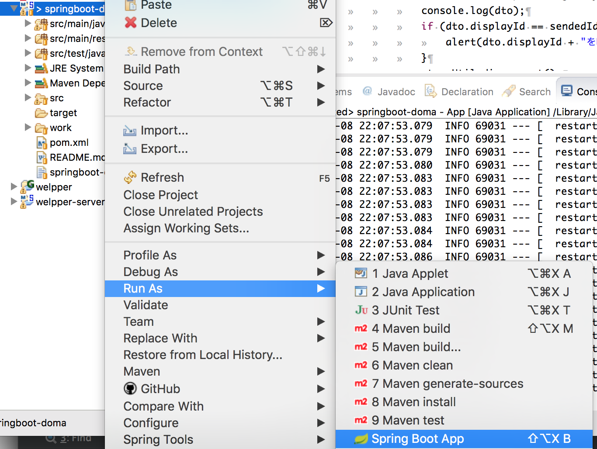

インストール方法
===================

STS環境で、以下の手順でサンプルプロジェクトをインポートします。

1.左ペインで右クリック 「import」 - 「Git」 「Projects from Git」を選択 「Next」

2.Clone URIを選択 「Next」

3.URIに「https://github.com/ko-aoki/springboot-doma.git」を入力し 「Next」

4.次画面の「Branch Selection」で「Next」

5.「Directory」で環境に合わせてパスを選択し「Next」

6.「import as general project」を選択し「Finish」

プロジェクトをimportした後、mavenを使用してコンパイルします。

7.importしたプロジェクトを右クリックし「Configure」-「Convert to Maven Project」

8.pom.xmlを右クリックし、「Run AS」-「Run Configurations」

9.「Base director」にpom.xml配置フォルダ、「Goals」に「package」を指定し「Run」

コンパイルされ、targetフォルダにjarファイルが生成されます。

.. note::
    pom.xml配置フォルダで以下コマンドを実行してもいいです。

    .. code-block:: console

        $ mvn package

アプリケーションを起動します。

10.プロジェクトを右クリックし、「Run As」-「Spring Boot App」

以下URLでログイン画面が表示されます。

http://localhost:8080/edu

.. figure:: ./images/install/11.png

以下のアカウントでログインできます。

管理者ユーザ：01/demo

一般ユーザ：02/demo
