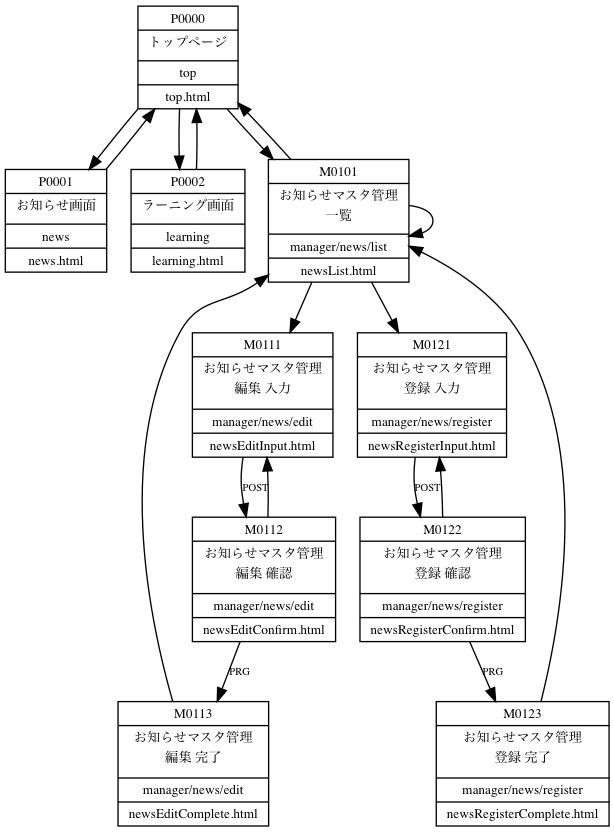

概要
===================

アプリケーションは以下の構成になります。

.. code-block:: console

    ├── pom.xml ... Maven設定ファイル
    └── src
        ├── main
        │   ├── java
        │   │   └── com
        │   │       └── example
        │   │           ├── App.java  ... アプリケーション実行ファイル
        │   │           ├── SecurityConfig.java  ... セキュリティ設定ファイル
        │   │           ├── dao  ... Doma2のDAOクラス格納パッケージ
        │   │           │   ├── MstEmployeeDao.java
        │   │           │   ├── MstNewsDao.java
        │   │           │   └── MstRoleDao.java
        │   │           ├── dto
        │   │           │   └── NewsDto.java
        │   │           ├── entity  ... Doma2のEntityクラス格納パッケージ
        │   │           │   ├── AuditEntity.java
        │   │           │   ├── MstEmployee.java
        │   │           │   ├── MstNews.java
        │   │           │   ├── MstRole.java
        │   │           │   ├── UserEntity.java
        │   │           │   └── listener
        │   │           │       └── AuditListener.java
        │   │           ├── security  ... Spring Securityの認証機能
        │   │           │   ├── LoginUserDetails.java
        │   │           │   ├── LoginUserDetailsService.java
        │   │           │   └── UserInfo.java
        │   │           ├── service  ... サービスクラス格納パッケージ
        │   │           │   ├── NewsService.java
        │   │           │   └── NewsServiceImpl.java
        │   │           └── web ... Spring MVC コントローラクラス格納パッケージ
        │   │               ├── LoginController.java
        │   │               ├── NewsController.java
        │   │               ├── TopController.java
        │   │               └── manager
        │   │                   ├── NewsForm.java
        │   │                   ├── NewsManagerEditController.java
        │   │                   ├── NewsManagerListController.java
        │   │                   └── NewsManagerRegisterController.java
        │   └── resources
        │       ├── META-INF
        │       │   └── com
        │       │       └── example
        │       │           └── dao ... Doma2のSQLファイル格納パッケージ
        │       │               ├── MstEmployeeDao
        │       │               │   ├── selectAll.sql
        │       │               │   ├── selectOne.sql
        │       │               │   └── selectUser.sql
        │       │               ├── MstNewsDao
        │       │               │   ├── selectAll.sql
        │       │               │   ├── selectNewsDtoByCond.sql
        │       │               │   └── selectOneNewsDto.sql
        │       │               └── MstRoleDao
        │       │                   └── selectAll.sql
        │       ├── ValidationMessages.properties ... バリデーションチェックのメッセージ設定ファイル
        │       ├── application.yml ... アプリケーション設定ファイル
        │       ├── data.sql ... 起動時に実行するDDL文
        │       ├── messages.properties ... バリデーションチェックメッセージのFormプロパティ置換設定ファイル
        │       ├── schema.sql ... 起動時に実行するDML文
        │       ├── static ... 実行時にはコンテキストルート直下になる静的ファイル格納フォルダ
        │       │   ├── css
        │       │   │   └── lib ... CSSライブラリ格納フォルダ
        │       │   │       ├── bootstrap-theme.min.css
        │       │   │       └── bootstrap.min.css
        │       │   ├── fonts ... フォント格納フォルダ(Bootstrap)
        │       │   │   ├── glyphicons-halflings-regular.eot
        │       │   │   ├── glyphicons-halflings-regular.svg
        │       │   │   ├── glyphicons-halflings-regular.ttf
        │       │   │   ├── glyphicons-halflings-regular.woff
        │       │   │   └── glyphicons-halflings-regular.woff2
        │       │   ├── js
        │       │   │   └── lib ... JavaScriptライブラリ格納フォルダ
        │       │   │       └── bootstrap.min.js
        │       │   └── movie
        │       │       ├── sample
        │       │       │   └── nc144421.mp4
        │       │       └── thumbnail
        │       │           ├── nc144421.jpg
        │       │           └── nc144555.jpg
        │       └── templates ... Thymeleafテンプレート格納フォルダ
        │           ├── learning
        │           │   └── learning.html
        │           ├── loginForm.html
        │           ├── manager
        │           │   ├── managerLayout.html
        │           │   └── news
        │           │       ├── edit
        │           │       │   ├── newsEditComplete.html
        │           │       │   ├── newsEditConfirm.html
        │           │       │   └── newsEditInput.html
        │           │       ├── list
        │           │       │   └── newsList.html
        │           │       └── register
        │           │           ├── newsRegisterComplete.html
        │           │           ├── newsRegisterConfirm.html
        │           │           └── newsRegisterInput.html
        │           ├── news
        │           │   └── news.html
        │           └── top
        │               └── top.html
        └── test ... テストコード格納フォルダ
            └── java
                └── com
                    └── example
                        └── service
                            └── NewsServiceImplTest.java

画面遷移は以下になります。

.. note::
    この画面遷移図はdot言語で記述、Graphvizで作成しています。

    参考：http://d.hatena.ne.jp/jun-yoshida/20070512/1179069363

    .. code-block:: dot

        digraph G {
            node [shape = record, height = .1, fontsize=10];
            edge [fontsize=8];

            /* 画面情報の定義 */
            PageTop      [label = "{<id>P0000 |<title>トップページ |<folder>top|<file>top.html}"];
            PageNews     [label = "{<id>P0001 |<title>お知らせ画面 |<folder>news |<file>news.html}"];
            PageLearning [label = "{<id>P0002 |<title>ラーニング画面|<folder>learning |<file>learning.html}"];

            PageManagerNewsList             [label = "{<id>M0101 |<title>お知らせマスタ管理\n一覧 |<folder>manager/news/list|<file>newsList.html}"];
            PageManagerNewsEditInput        [label = "{<id>M0111 |<title>お知らせマスタ管理\n編集 入力 |<folder>manager/news/edit|<file>newsEditInput.html}"];
            PageManagerNewsEditConfirm      [label = "{<id>M0112 |<title>お知らせマスタ管理\n編集 確認 |<folder>manager/news/edit|<file>newsEditConfirm.html}"];
            PageManagerNewsEditComplete     [label = "{<id>M0113 |<title>お知らせマスタ管理\n編集 完了 |<folder>manager/news/edit|<file>newsEditComplete.html}"];
            PageManagerNewsRegisterInput    [label = "{<id>M0121 |<title>お知らせマスタ管理\n登録 入力 |<folder>manager/news/register|<file>newsRegisterInput.html}"];
            PageManagerNewsRegisterConfirm  [label = "{<id>M0122 |<title>お知らせマスタ管理\n登録 確認 |<folder>manager/news/register|<file>newsRegisterConfirm.html}"];
            PageManagerNewsRegisterComplete [label = "{<id>M0123 |<title>お知らせマスタ管理\n登録 完了 |<folder>manager/news/register|<file>newsRegisterComplete.html}"];

            /* 画面遷移定義 */
            PageTop                         -> PageNews                ;
            PageNews                        -> PageTop                 ;
            PageTop                         -> PageLearning            ;
            PageLearning                    -> PageTop                 ;
            PageTop                         -> PageManagerNewsList     ;
            PageManagerNewsList             -> PageTop                 ;

            PageManagerNewsList             -> PageManagerNewsList     ;
            PageManagerNewsList             -> PageManagerNewsEditInput     ;
            PageManagerNewsEditInput        -> PageManagerNewsEditConfirm   [label="POST"];
            PageManagerNewsEditConfirm      -> PageManagerNewsEditInput     ;
            PageManagerNewsEditConfirm      -> PageManagerNewsEditComplete  [label="PRG"];
            PageManagerNewsEditComplete     -> PageManagerNewsList          ;

            PageManagerNewsList             -> PageManagerNewsRegisterInput     ;
            PageManagerNewsRegisterInput    -> PageManagerNewsRegisterConfirm   [label="POST"];
            PageManagerNewsRegisterConfirm  -> PageManagerNewsRegisterInput     ;
            PageManagerNewsRegisterConfirm  -> PageManagerNewsRegisterComplete  [label="PRG"];
            PageManagerNewsRegisterComplete -> PageManagerNewsList          ;

        }

