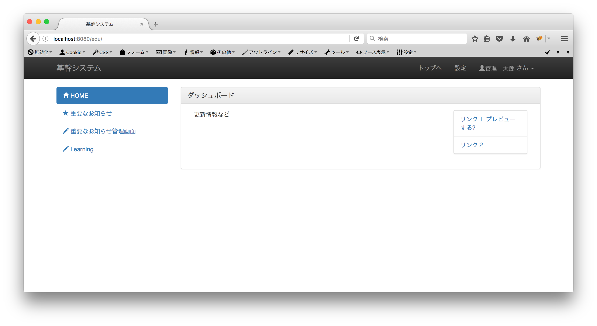

Spring MVC 基本
===================

以下URLで、ログインするとトップ画面に遷移します。

http://localhost:8080/edu

(ユーザ/パスワード　01/test)

ログイン画面はSpring Securityの機能なので、ここではトップ画面がどのように表示されるのかを確認します。

対象URL(http://localhost:8080/edu)にアクセスすると、リクエストがマッピングされ、以下のコントローラクラスが処理を実行します。

TopController.java

.. code-block:: java

    @Controller // コントローラクラスのアノテーション
    @RequestMapping("/")   // URLとのマッピング
    public class TopController {
        /**
         * トップ画面.
         * @return テンプレートパス
         */
        @RequestMapping(method = RequestMethod.GET)
        public String top(Model model, @AuthenticationPrincipal LoginUserDetails userDetails) {

            return "top/top";   // 対応するテンプレートのパス
        }
    }

topメソッドの戻り値から以下のテンプレートが表示されます。

.. code-block:: console

           └── resources
               └── templates ... Thymeleafテンプレート格納フォルダ
                   └── top
                       └── top.html

テンプレートはthymeleaf形式のhtmlです。
JSPとは異なり、ファイル単体で表示可能です。

HTMLとの値受け渡しは（ここでは）Formクラスを使用します。

NewsListCondForm.java

.. code-block:: java

    /**
     * お知らせ一覧画面条件フォームクラス.
     */
    public class NewsListCondForm {

        /** ページ */
        private Integer page;
        /** 表題 */
        private String subject;
        /** 権限 */
        private String roleId;
        /** 権限名 */
        private String roleNm;
        /** URL */
        private String url;

        // getter, setter
     }

コントローラのメソッドの引数にFormクラスを指定します。

NewsManagerListController.java

.. code-block:: java

    /**
     * お知らせ管理リスト画面のコントローラクラス.
     */
    @Controller
    @RequestMapping("manager/news/list")
    @SessionAttributes({"roleIdMap"})
    public class NewsManagerListController {

        /** ロガー */
        private static final Logger logger = LoggerFactory.getLogger(NewsManagerListController.class);

        /** お知らせ機能のサービスクラス */
        @Autowired
        NewsService service;

        /**
         * 権限のコンボボックスを初期化します.
         * @return
         */
        @ModelAttribute("roleIdMap")
        public Map<String, String> setupRoleIdMap() {
            return service.retrieveRoleIdMap();
        }

        /**
         * 「重要なお知らせ」リスト画面を表示します.
         * @param form : お知らせForm
         * @param model : モデル
         * @return
         */
        @GetMapping
        public String display(NewsListCondForm form,
                            Model model) {

            int page = 0;
            if (form.getPage() == null) {
                page = 0;
                form.setPage(1);
            } else {
                page = form.getPage() - 1;
            }
            Page<NewsDto> newsList = service.findNewsPage(form.getSubject(), form.getRoleId(), form.getUrl(), page);
            if (newsList.getTotalElements() > 0) {
                model.addAttribute("newsList", newsList);
            }

            return "/manager/news/list/newsList";
        }
    }

引数のModelは連携するデータを表すクラスです。
\ ``addAttribute`` \メソッドでhtmlに引き渡すデータを設定します。
\ ``ModelAttribute`` \はリクエストを受けるメソッドの実行前に自動で実行されるメソッドで、\ ``addAttribute`` \と同様の処理になります。
クラスにアノテーションされている\ ``@SessionAttributes`` \で指定した値の属性はセッションに格納され、セッションに存在する場合は、再実行されません。

FormクラスとHTMLの関連は以下のように行います。

newsList.html

.. code-block:: html

    <!DOCTYPE html>
    <html xmlns="http://www.w3.org/1999/xhtml"
          xmlns:th="http://www.thymeleaf.org"
          xmlns:sec="http://www.thymeleaf.org/extras/spring-security4"
          xmlns:layout="http://www.ultraq.net.nz/web/thymeleaf/layout"
          layout:decorator="manager/managerLayout">
    <head>
        <!-- 略 -->
    </head>
    <body>
    <!-- メインコンテンツ -->
    

        

            

                

                    
<h3 class="panel-title">「重要なお知らせ」管理画面</h3>

                    

                        

                            <form id="news-input-form" th:action="@{/manager/news/list}"
                                  th:object="${newsListCondForm}" method="get">
                                <input id="page" th:field="*{page}" type="hidden" />
                                <label for="subject">お知らせ表題</label>
                                <input class="form-control" id="subject" type="text" th:field="*{subject}"/>
                                <label for="role-id">権限</label>
                                <select class="form-control" id="role-id" name="roleId">
                                    <option value="">---</option>
                                    <option th:each="item : ${roleIdMap}" th:value="${item.key}" th:text="${item.value}"
                                            th:selected="${item.key} == *{roleId}">pulldown
                                    </option>
                                </select>
                                <label for="url">お知らせURL</label>
                                <input class="form-control" id="url" type="text" th:field="*{url}"/>
                                 
                                

                                    

                                        <button type="button" th:onclick="'pageJump(1);'" class="btn-primary">検索</button>
                                    

                                    

                                        <a th:href="@{'/manager/news/register?input'}">新規作成</a>
                                    

                                

                                <!-- 略 -->
                            </form>
                        

                        <!-- 略 -->
                    

                

            

        

    

    </body>
    </html>

\ ``<form id="news-input-form" th:action="@{/manager/news/list}" th:object="${newsListCondForm}" method="get">`` \
上記のように、通常のHTMLにth属性を設定しています。Thymeleafがth:action属性を解釈し、通常のHTML属性に変更します。
th:object属性はコントローラで指定したFormクラスです。
Formタグ内のth:field属性でFormクラスのプロパティと対応させます。

