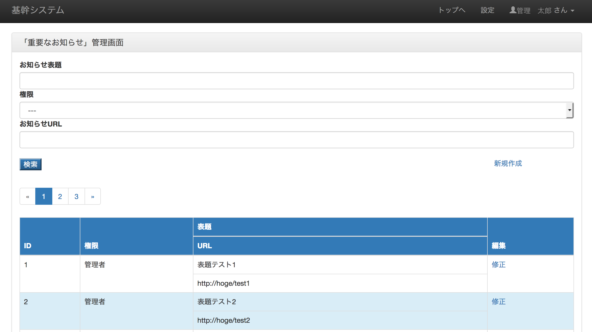
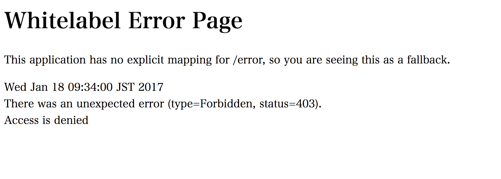

Spring Security
===================

以下URLにアクセスすると、ログイン画面にリダイレクトされます。

http://localhost:8080/edu

→

http://localhost:8080/edu/loginForm

.. figure:: ./images/spring_security/01.png

以下のユーザ/パスワードでログイン可能です。

管理者：01/demo

一般：02/demo

設定
--------------------------

セキュリティの設定は以下のクラスになります。

SecurityConfig.java

.. code-block:: java

    /**
     * Spring Security設定.
     */
    @EnableWebSecurity  // Spring Securityが提供するConfigurationクラスのインポート
    // WebSecurityConfigurerAdapterでデフォルトのBean定義を適用
    public class SecurityConfig extends WebSecurityConfigurerAdapter {

        @Override
        protected void configure(HttpSecurity http) throws Exception {
            http.authorizeRequests()
                    .antMatchers("/loginForm").permitAll()
                    // /manager配下はADMIN権限のみ(自動でROLE_が付加されROLE_ADMIN)
                    .antMatchers("/manager/**").hasRole("ADMIN")
                    // 認証していないリクエストは不許可
                    .anyRequest().authenticated();
            // フォーム認証
            http.formLogin()
                    // 認証パス
                    .loginProcessingUrl("/login")
                    // ログインフォーム表示用のパス設定
                    .loginPage("/loginForm")
                    // 認証失敗時のパス
                    .failureUrl("/loginForm?error")
                    // 認証成功時のパス
                    .defaultSuccessUrl("/", true)
                    // ユーザ名のリクエストパラメータ
                    .usernameParameter("id")
                    // パスワードのリクエストパラメータ
                    .passwordParameter("password");
            http.logout()
                     // ログアウトURL
                    .logoutRequestMatcher(new AntPathRequestMatcher("/logout**"))
                    // ログアウト後の遷移先
                    .logoutSuccessUrl("/loginForm");
            http.headers()
                    .cacheControl();
        }

        /**
         * パスワードの暗号化方式
         */
        @Bean
        PasswordEncoder passwordEncoder() {
            return new BCryptPasswordEncoder();
        }
    }

管理者：01/demo

で管理用のURLにアクセスしてみます。

http://localhost:8080/edu/manager/news/list

マスタメンテ画面にアクセスできます。

以下のユーザでアクセスすると403エラー画面が表示されます。

一般：02/demo

ログインには、対応するコントローラとテンプレートを用意します。

LoginController.java

.. code-block:: java

    /**
     * ログイン画面のコントローラ.
     */
    @Controller
    public class LoginController {

        @RequestMapping("loginForm")
        String loginForm() {
            return "loginForm";
        }
    }

LoginForm.html

.. code-block:: html

    <!DOCTYPE html>
    <html xmlns="http://www.w3.org/1999/xhtml" xmlns:th="http://www.thymeleaf.org">
    <head>
        <meta charset="utf-8"/>
        <meta name="viewport" content="width=device-width, initial-scale=1.0" />
        <title>基幹システムログイン</title>
        <link rel="stylesheet" type="text/css" href="../../static/css/lib/bootstrap.min.css" th:href="@{/css/lib/bootstrap.min.css}"/>
        <link rel="stylesheet" type="text/css" href="../../static/css/lib/bootstrap-theme.min.css" th:href="@{/css/lib/bootstrap-theme.min.css}"/>
    </head>

    <body>

    

        <h2>ログイン</h2>
        <form class="form-signin" method="post" th:action="@{/login}">
            

                IDまたはパスワードが正しくありません。
            

            <input type="text" class="form-control" name="id" placeholder="ID" required="required"
                   autofocus="autofocus"/>
             
            <input type="password" class="form-control" name="password" placeholder="Password" required="required"/>
             
            <button class="btn btn-lg btn-primary" type="submit">ログイン</button>
        </form>
    

    </body>
    </html>

パスによるアクセス可否、ログインは上記の設定クラスで可能です。

DBとの連携
--------------------------

ユーザ/パスワードはDB管理しています。

schema.sql

.. code-block:: sql

    -- 従業員マスタ
    CREATE TABLE mst_employee
    (
        employee_id varchar(10) NOT NULL COMMENT '従業員番号',
        employee_last_name varchar(50) COMMENT '姓',
        employee_first_name varchar(50) COMMENT '名',
        role_id varchar(10) NOT NULL COMMENT '権限ID',
        version int COMMENT 'バージョン',
        insert_user varchar(20) COMMENT '登録ユーザ',
        insert_date datetime COMMENT 'insert_date',
        update_user varchar(20) COMMENT '更新ユーザ',
        update_date datetime COMMENT 'update_date',
        PRIMARY KEY (employee_id)
    ) COMMENT = '従業員マスタ';

    -- パスワードマスタ
    CREATE TABLE mst_password
    (
        mst_password_id int NOT NULL COMMENT 'パスワードマスタID',
        employee_id varchar(10) NOT NULL COMMENT '従業員番号',
        password varchar(256) COMMENT 'パスワード',
        generation varchar(2) COMMENT 'パスワード世代',
        version int COMMENT 'バージョン',
        insert_user varchar(20) COMMENT '登録ユーザ',
        insert_date datetime COMMENT 'insert_date',
        update_user varchar(20) COMMENT '更新ユーザ',
        update_date datetime COMMENT 'update_date',
        PRIMARY KEY (mst_password_id),
        UNIQUE (employee_id, generation)
    ) COMMENT = 'パスワードマスタ';

    -- 権限マスタ
    CREATE TABLE mst_role
    (
        role_id varchar(20) NOT NULL COMMENT '権限ID',
        role_name varchar(100) COMMENT '権限名',
        version int COMMENT 'バージョン',
        insert_user varchar(20) COMMENT '登録ユーザ',
        insert_date datetime COMMENT 'insert_date',
        update_user varchar(20) COMMENT '更新ユーザ',
        update_date datetime COMMENT 'update_date',
        PRIMARY KEY (role_id)
    ) COMMENT = '権限マスタ';

data.sql

.. code-block:: sql

    insert into mst_employee (employee_id, employee_last_name, employee_first_name, role_id) values('01', '管理', '太郎', 'ROLE_ADMIN');
    insert into mst_employee (employee_id, employee_last_name, employee_first_name, role_id) values('02', '一般', '二郎', 'ROLE_USER');
    insert into mst_role (role_id, role_name) values('ROLE_ADMIN', '管理者');
    insert into mst_role (role_id, role_name) values('ROLE_USER', '一般');
    insert into mst_password (mst_password_id, employee_id, password) values(1, '01', '$2a$10$1gJJgBlL75OIjkSgkYPXI.mV7ihEPjxIiCkXKBEc7/r9xUIjZyc9i');
    insert into mst_password (mst_password_id, employee_id, password) values(2, '02', '$2a$10$1gJJgBlL75OIjkSgkYPXI.mV7ihEPjxIiCkXKBEc7/r9xUIjZyc9i');

DB管理したユーザ情報を認証に使用する手順は以下です。

1.\ ``org.springframework.security.core.userdetails.UserDetailsService`` \を継承したサービスクラスを作成する。

LoginUserDetailsService.java

.. code-block:: java

    /**
     * Spring Securityで使用するログイン時に取得するユーザ情報サービスクラス.
     */
    @Service
    public class LoginUserDetailsService implements UserDetailsService {
        @Autowired
        MstEmployeeDao dao;

        @Override
        public UserDetails loadUserByUsername(String id) throws UsernameNotFoundException {
            UserEntity user = dao.selectUser(id);

            UserInfo userInfo = new UserInfo();

            userInfo.setId(user.getEmployeeId());
            userInfo.setEmployeeFirstName(user.getEmployeeFirstName());
            userInfo.setEmployeeLastName(user.getEmployeeLastName());
            userInfo.setRoleId(user.getRoleId());
            userInfo.setPassword(user.getPassword());

            if (userInfo == null) {
                throw new UsernameNotFoundException("The requested user is not found.");
            }
            return new LoginUserDetails(userInfo);
        }
    }

\ ``loadUserByUserName`` \メソッドでDaoによりDBアクセスしています。
パスワードとはここでは確認せず、ユーザIDのみに合致するデータを取得しています。

.. code-block:: sql

    SELECT
        e.employee_id employee_id,
        e.employee_last_name employee_last_name,
        e.employee_first_name employee_first_name,
        e.role_id role_id,
        p.password password
    FROM
      mst_employee e
    INNER JOIN
      mst_password p
    ON
      e.employee_id = p.employee_id
    INNER JOIN
      mst_role r
    ON
      e.role_id = r.role_id
    WHERE
      e.employee_id = /* id */'01'
    ;

2.\ ``org.springframework.security.core.userdetails.User`` \を継承したユーザ情報クラスを作成する。

LoginUserDetailsService.java

.. code-block:: java

    /**
     * Spring Securityで使用するログイン時に取得するユーザ情報.
     */
    public class LoginUserDetails extends User {

        /** ログイン情報 */
        private UserInfo userInfo;

        public LoginUserDetails(UserInfo userInfo) {
            super(userInfo.getId(), userInfo.getPassword(), AuthorityUtils.createAuthorityList(userInfo.getRoleId()));
            this.userInfo = userInfo;
        }

        public UserInfo getUserInfo() {
            return this.userInfo;
        }
    }

ユーザ情報のID、パスワード、権限をコンストラクタに設定しています。
上記により、認証および認可が有効になります。

ユーザ情報取得
--------------------------

ログイン時に取得したユーザ情報は、以下で使用可能です。

コントローラクラス

.. code-block:: java

    /**
     * お知らせ画面のコントローラ.
     */
    @Controller
    @RequestMapping("news")
    public class NewsController {

        /** ロガー */
        private static final Logger logger = LoggerFactory.getLogger(NewsController.class);

        /**
         *
         * @return
         */
        @RequestMapping(method = RequestMethod.GET)
        public String init(Model model, @AuthenticationPrincipal LoginUserDetails userDetails) {

            model.addAttribute("loginInfo", userDetails.getUserInfo());
            return "news/news";
        }

    }

メソッドの引数で取得可能です。

他クラス

.. code-block:: java

    private UserInfo getUserInfo() {
        Authentication auth = SecurityContextHolder.getContext().getAuthentication();
        if (auth == null) {
            return null;
        }
        LoginUserDetails userDetails = (LoginUserDetails) auth.getPrincipal();
        if (userDetails == null) {
            return null;
        }
        return userDetails.getUserInfo();
    }

ユーザ情報はThreadLocalで保持され、SecurityContextHolder経由でアクセス可能です。

Thymeleaf

.. code-block:: html

    <html xmlns="http://www.w3.org/1999/xhtml"
          xmlns:th="http://www.thymeleaf.org"
          xmlns:sec="http://www.thymeleaf.org/extras/spring-security4">

htmlタグにxmlns:sec属性を指定する必要があります。

.. code-block:: html

                    <a href="#" class="dropdown-toggle" data-toggle="dropdown" >
                         さん
                        <b class="caret"></b>
                    </a>

ユーザ情報が取得できます。

.. code-block:: html

                <li sec:authorize="hasRole('ADMIN')"><a th:href="@{/manager/news/list}" href="#learning"> 重要なお知らせ管理画面</a>

権限による表示切り替えが可能です。（DBではROLE_ADMINですが、ROLE_は無視して記述します）

参考
--------------------------

Spring Securityに限りませんがTERASOLUNAのガイドが詳細なので、参照してください。

http://terasolunaorg.github.io/guideline/5.1.0.RELEASE/ja/Security/Authentication.html